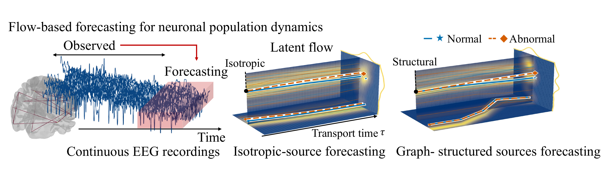
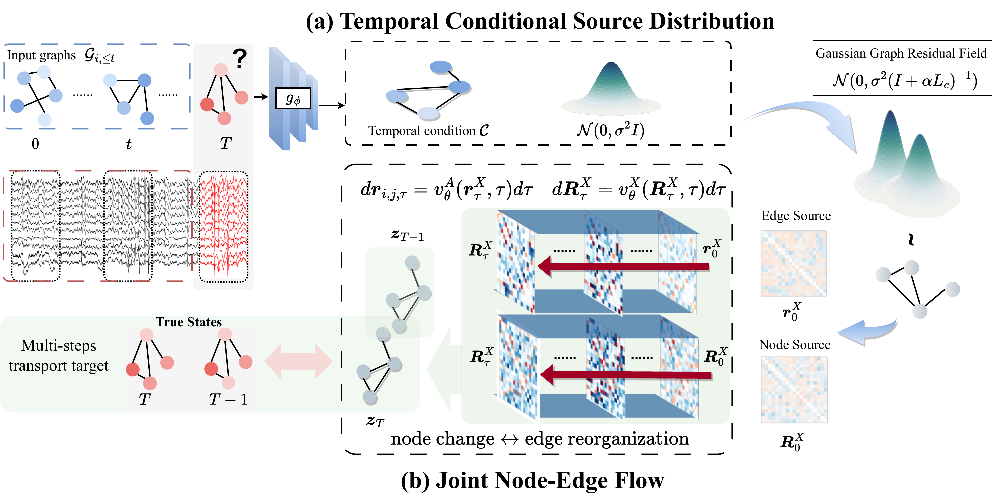

# GRFBrain: Graph-Structured Rectified Flows for EEG Dynamic Modeling

Forecasting time-varying functional connectivity from electroencephalography (EEG) requires modeling both history-dependent trends and structured variability across channels. Conditional flow matching provides a framework for distributional forecasting, yet it remains unclear whether graph-informed source distributions offer practical advantages over isotropic noise and strong deterministic predictors. We introduce a graph-structured residual flow framework that separates conditional mean prediction from stochastic residual transport. A history-only predictor estimates the future connectivity graph, while a graph Gaussian source encodes dependencies derived from past connectivity through a Laplacian-based covariance. A conditional velocity field transports source samples to future graph residuals, with transport time explicitly distinguished from physical EEG time. Our study identifies the conditions and controls needed to distinguish useful residual transport from improvements attributable to deterministic prediction, learned representations, and sampling effects.

## Overview of GRFBrain

[](docs/figures/concept.pdf)


## Method overview

[](docs/figures/overview.pdf)


## Interactive 3D visualization

Explore predicted FC states and signed edge velocities for non-seizure and
seizure examples. Rotate and zoom the linked 3D views, select class medians or
individual samples, and adjust brain opacity and transport time τ.

**[Open the interactive 3D visualization →](https://hhjianmo.github.io/eeg-conditional-ggrf-visualization/)**

Or **[download the interactive HTML](docs/visualization/index.html)** using the
file page's **Download raw file** button, then open it in a browser. An internet
connection is required to load Plotly. GitHub's README and file preview do not
execute interactive HTML; use the live page linked above.

Original recording filenames and source indices are omitted from this page.
The visualization shows transport trajectories; the default downstream
classifier.

## Data contract

We use **Temple University Seizure Corpus (TUSZ)** dataset, publicly available at: [here](https://isip.piconepress.com/projects/tuh_eeg/).
Once your request form is accepted, you can access the dataset.

- 19 aligned EEG channels sampled at 200 Hz.
- Twelve non-overlapping one-second windows per example.
- Each window is a 100-dimensional log-amplitude FFT per channel.
- The first 11 windows are the causal condition; window 12 is the future target.
- Dynamic graphs are absolute Spearman similarities with directed top-3
  sparsification. They are not coherence, PLV, or STFT graphs.
- Raw TUSZ files are not distributed. A JSONL manifest points to user-owned
  `.npy`/`.npz` clips and supplies labels and split membership.

See [docs/data_format.md](docs/data_format.md) and
[docs/architecture.md](docs/architecture.md).

## Installation

```bash
conda env create -f environment.yml
conda activate eeg-cgfm
pip install -e '.[dev]'
./init.sh
```

## Verification without EEG data

After installation, run `./init.sh` from the repository root. It runs the five
contract tests and a synthetic forward/backward smoke check; successful output
includes `EEG_CGFM_SMOKE_OK`. No EEG data or pretrained weights are required.

## Quick start

```bash
# 1. Convert aligned 19-channel, 12-second clips to the stable NPZ contract.
eeg-cgfm-prepare \
  --manifest manifests/train.jsonl \
  --output data/processed/train

# Repeat for dev/test. Fit normalization on train only and pass the saved stats
# to dev/test; see --help and docs/data_format.md.

# 2. Pretrain the conditional Joint Node–Edge Flow field.
eeg-cgfm-pretrain \
  --config configs/default.yaml \
  --train-manifest data/processed/train/manifest.jsonl \
  --dev-manifest data/processed/dev/manifest.jsonl \
  --output outputs/flow_pretrain

# 3. Train the deterministic node-hidden readout.
eeg-cgfm-train \
  --config configs/default.yaml \
  --flow-checkpoint outputs/flow_pretrain/best.pt \
  --train-manifest data/processed/train/manifest.jsonl \
  --dev-manifest data/processed/dev/manifest.jsonl \
  --output outputs/node_hidden_no_transport

# 4. Apply the frozen dev-selected checkpoint and threshold to test.
eeg-cgfm-evaluate \
  --config configs/default.yaml \
  --checkpoint outputs/node_hidden_no_transport/best.pt \
  --manifest data/processed/test/manifest.jsonl \
  --output outputs/test
```

The training CLIs are intentionally simple reference runners. For a paper run,
freeze split manifests, normalization statistics, seeds, checkpoints and dev
thresholds before opening test.

`eeg-cgfm-pretrain` re-estimates `q_X/q_A` from training data after fitting the
past-only graph forecaster and stores them in `calibration.json`. The supplied
YAML values reproduce the current TUSZ contract but are not universal constants.

## Importing an existing checkpoint

The released submodule names preserve the original field, temporal encoder,
graph forecaster and readout state dictionaries. If you are an authorized owner
of the original checkpoints, combine them into one portable file:

```bash
eeg-cgfm-import-evobrain \
  --config configs/default.yaml \
  --hidden-checkpoint /path/to/node_hidden_no_transport/best.pt \
  --edge-predictor-checkpoint /path/to/graph_forecaster/best.pth.tar \
  --output checkpoints/node_hidden_no_transport.pt
```

The command copies learned states and frozen source scales but does not copy raw
data, caches or private paths into the model itself. Check checkpoint sharing
permissions before publication.

## Repository contents

- `src/eeg_cgfm/data`: log-FFT preprocessing, Spearman top-k graph construction,
  stable NPZ dataset contract.
- `src/eeg_cgfm/models/ggrf.py`: history-conditioned graph Gaussian operators and
  node/edge source sampling.
- `src/eeg_cgfm/models/graph_forecaster.py`: deterministic conditional edge mean.
- `src/eeg_cgfm/models/joint_transformer.py`: bidirectional node-edge velocity
  field with FiLM, edge-biased node attention and node-to-edge messages.
- `src/eeg_cgfm/models/system.py`: temporal condition, normalized FM objective,
  and deterministic no-transport readout.
- `src/eeg_cgfm/cli`: data, training, evaluation and smoke entry points.
- `tests`: tensor-shape, causality, covariance, symmetry and gradient contracts.

## Reproducibility and licensing

No TUSZ data, pretrained weights, result caches, private paths or legacy SDE code
are included. TUSZ access and redistribution remain governed by its provider.
Code in this extraction is released under MIT; verify third-party dataset and
checkpoint permissions separately before public distribution.
